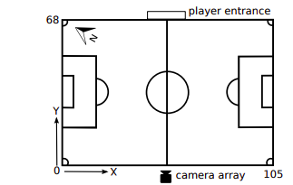
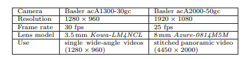

This files contain important information regarding the parameters used in the project

The dataset consists of videos and correlated body-sensor data for the home team from three different games played and recorded at Alfheim stadium located in Tromsø, Norway, during November 2013. Although the sensor system in use can capture data from both teams, the away teams were not equipped with the required sensor belts during these
games

### Pitch co-ordinate system
The positive x-axis points southwards parallel along the long
side of the field, while the positive y-axis points eastwards
parallel with the short edge of the field, as shown in Figure 1.
The position (0, 0) is located in the north-western corner of
the soccer field, which from the position of the cameras is
the lower-left corner. The soccer pitch is 105 × 68 m wide
and hence valid in-field values for x and y are in the range
of 0 ≤ x ≤ 105 and 0 ≤ y ≤ 68  

### Cameras mounted
We provide two different sets of video data from two different cameras. The first set is a collection of shutter synchronized videos that are captured using
three wide-angle cameras (acA1300-30gc). The second set is
a stitched high-quality panoramic video using five cameras
(acA2000-50gc). Both video types cover the entire soccer
field. 
**Wide-Angle Cameras**
To capture different parts of the field , we have
used three Basler acA1300-30gc cameras recording simultaneously from the center of one of the sides using 3.5 mm KowaLM4NCL lenses. The provided videos are processed to correct for the distortions created by the wide-angle lens. There
is also sufficient overlap between adjacent cameras for applications like panorama stitching. 

**High-Quality Panorama**
The provided set of high-quality cylindrical panorama video
is stitched together from the images of five Basler acA2000-
50gc cameras with 8 mm Azure-0814M5M lenses. The cameras are placed inside the control room at Alfheim so that
the video includes audience, which can, for instance, be used
for analyzing crowd behavior. An example frame from the
panorama video for the two first games is shown in Figure 4.
For the Tottenham game, the camera array is moved closer
to the field    

**Note:** In this project we have used the panoramic view stiched together for the Tottenham match played  
