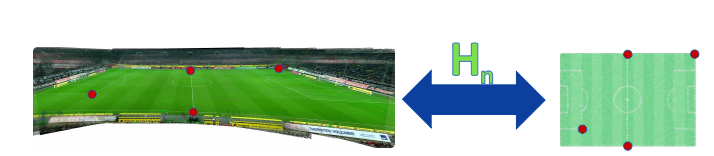

# Football-Player-Tracking
Computer vision based framwork for player tracking and analysis in football videos

## Description
In this project i aim is to do Computer Vision based analysis on a live football video stream or a recorded football match which can be used as a football analytics tool. My plan is primarily based on the ideas preseneted in this paper [1](https://openaccess.city.ac.uk/18380/8/paper319.pdf) with the end goal that the same system can be portable to be used in other sports too. Generally a video stream from a live match only gives view of a certain section of the pitch, one of my things i aim to  is to be able to convert it to whole pitch representation i.e a panoramic view for easier interpration in terms of a global view. 
 
Along the with the panoramic view generator, i will also try to make 2d pitch representation of the pitch to map the live player positions.The 2-d mappings will be used to calculate various foobtall metrics like player trajectories, team structures etc.
 
I plan to read to more research papers on basis of the use-cases of which tools will be required to do the above mentioned stuff

Datasets that can be used:[Soccer video & Position dataset](https://datasets.simula.no/alfheim/)

## Aims
1. Using homography to  
  1.1 Create panoramic views 
  1.2 Projecting current video frame to panoramic view 
  1.3 Projecting current video frame to to 2d pitch representation
3. Try out various player tracking approaches to identify player positions on the 2d homagraphic pitch view
4. Calculate various football analysis metric possible,like 
  4.1 Player trajectories 
  4.2 Team structure 

## Literature review
1. [Bring it to the Pitch: Combining Video and Movement Data to
Enhance Team Sport Analysis - 2018](https://openaccess.city.ac.uk/18380/8/paper319.pdf)
